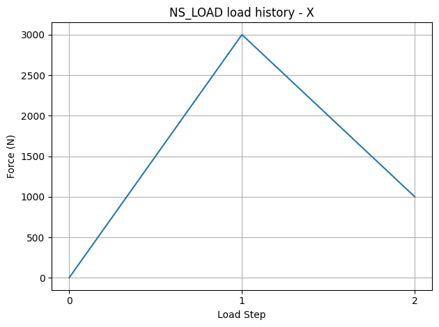

# Structural Analysis Toolbox (stbox)

The main target of the library is creating an easy to follow structural analysis (solid mechanics) modelling workflow and implementation with a solver (mapdl). It provides a high-level implementation of apdl commands through PyMAPDL. 

## Key Features

* Internal Material Library (CRUD support)
* Readable Type-Hints
* Extensive Visualization
* OOP approach

## Workflow

External Mesh Import --> Modelling --> Send to the Solver

## An Example Project Structure
```text
 ├── Element Types
 │   ├── SOLID185
 │   └── MPC184
 ├── Materials
 │   └── My Steel
 ├── Sets
 │   ├── Node Sets
 │   │   ├── NS_FIX
 │   │   ├── NS_LOAD
 │   │   └── NS_LOAD_DEPEN
 │   └── Element Sets
 │       └── MESH
 ├── Surfaces
 ├── Sections
 ├── Constraints
 │   ├── Linear Couplings
 │   ├── Constraint Equations
 │   ├── MPC
 │   │   └── MPC-1
 │   └── Joints
 ├── Contacts
 └── Load Steps
```

## Methods


## Visualization Example : Load-History Plot



## Installation

..

## Usage

[stbox Examples](examples)


